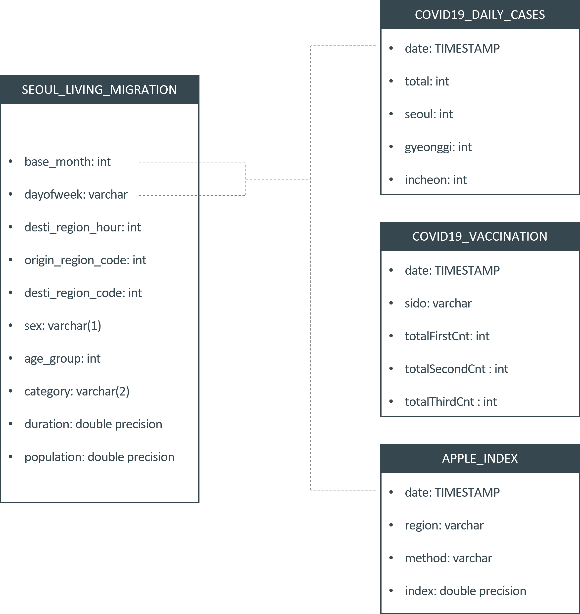

# Mobility & COVID19 airflow pipeline

This project has been done as a capstone for Udacity Data Engineering Nanodegree.

## Introduction

This project aims to build a PostgreSQL database of COVID-19 and mobility in Seoul City, South Korea. <br/>

For this purpose, I used Apache Airflow to collect tables from various sources like Public API and Amazon S3. Some tables will be transformed with Pandas while it is being loaded in Airflow tasks.

After building the ETL (I mean if I can pass this capstone), my plan is to write a report about the relationship between daily movements, confirmed cases, and the number of vaccinated people.

### Why airflow?
I am thinking about an automated ETL pipeline based on its interval time. At this time, I used the monthly dataset because the city government of Seoul uploaded monthly movements data only on their open data portal. So, I was thinking about the ETL pipeline that updates a Postgres database monthly.   

### Addressing Other Scenarios
1) The data was increased by 100x. : If I have to handle 100 times bigger datasets for the project, I will use Apache Spark or Dask to do the distributed computing. Also, I will consider using AWS computing power and storage because my laptop will not be able to handle the dataset. 
2) The pipelines would be run on a daily basis by 7 am every day. : I can set the specific time and interval of updating for the data pipeline in Airflow
3) The database needed to be accessed by 100+ people. : I will use the Amazon Redshift or S3 (serve as CSV formatted file) instead of the local Postgres server.

## Install / Clone
To clone this project, do this:
```git clone https://github.com/Aete/mobility_covid_airflow_pipeline.git ```

### Dependancy
Please check ```requirement.txt```

## Data


In the project, there are four tables: 'seoul_living_migration', 'covid19_daily_cases', 'covid19_vaccination', and 'apple_index'. The Main issue is that temporal information of 'seoul_living_migration' data consists of the month and day of the week, but the other datasets were based on daily information. In the project, I didn't aggregate the other tables by month because I still thought the day of the week could be important factor of urban mobility.  

### Seoul Living Migration
This table is the statistically deduced number of citizens' trips between neighborhoods by the hour, day of the week, sex, and trip category in each month.
- base_month: month and year ex) 202202
- dayofweek: day of the week ex) mon (=Monday)
- desti_region_hour: hour of arrival time ex) 7
- origin_region_code: code (id) of origin neighborhood (administrative 'dong')
- desti_region_code: code (id) of origin neighborhood (administrative 'dong')
- sex: M (Male) or F (Female)
- age_group: 5 years age group
- category: trip category consisted with two character (W: workplace, H: home, E: etc, ex) WW (workplace -> workplace), HW (home -> workplace)
- duration: duration of the trip
- population: deduced number of citizen trips between neighborhoods

### COVID 19 Daily new confirmed cases
This table is about the number of daily new confirmed cases in South Korea
- date: TIMESTAMP WITHOUT TIME ZONE
- total: the number of daily new confirmed cases in South Korea
- seoul: the number of daily new confirmed cases in Seoul
- gyeonggi: the number of daily new confirmed cases in Gyeonggi
- incheon: the number of the daily new confirmed cases in Incheon

### COVID 19 Daily Vaccination history
This table is about the number of cumulative vaccinated people in South Korea
- date: TIMESTAMP WITHOUT TIME ZONE
- sido: the name of the city (or province)
- totalFirstCnt : the number of the cumulative vaccinated people who were only vaccinated one time
- totalSecondCnt: the number of the cumulative vaccinated people who were only vaccinated twice
- totalThirdCnt: the number of the cumulative vaccinated people who were only vaccinated three times

### Apple mobility index
This table consists of the apple mobility index for Seoul
- region: Seoul,   
- method: walking or driving,    
- date: TIMESTAMP WITHOUT TIME ZONE,
- index: index score
